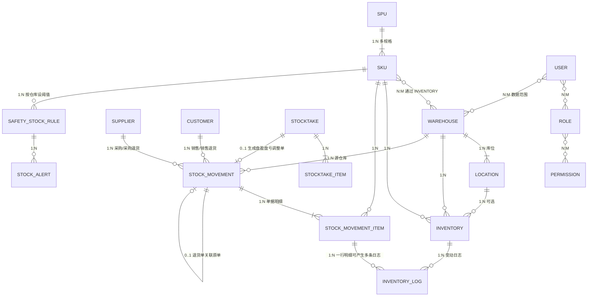
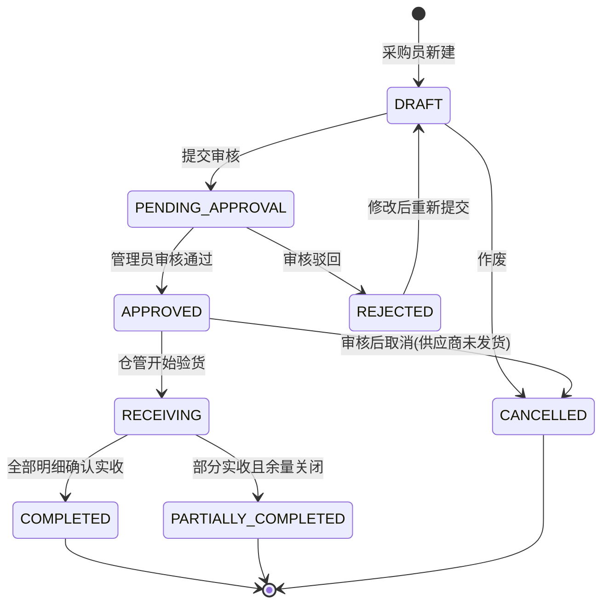
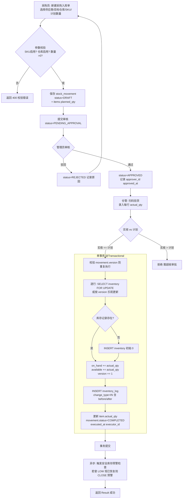
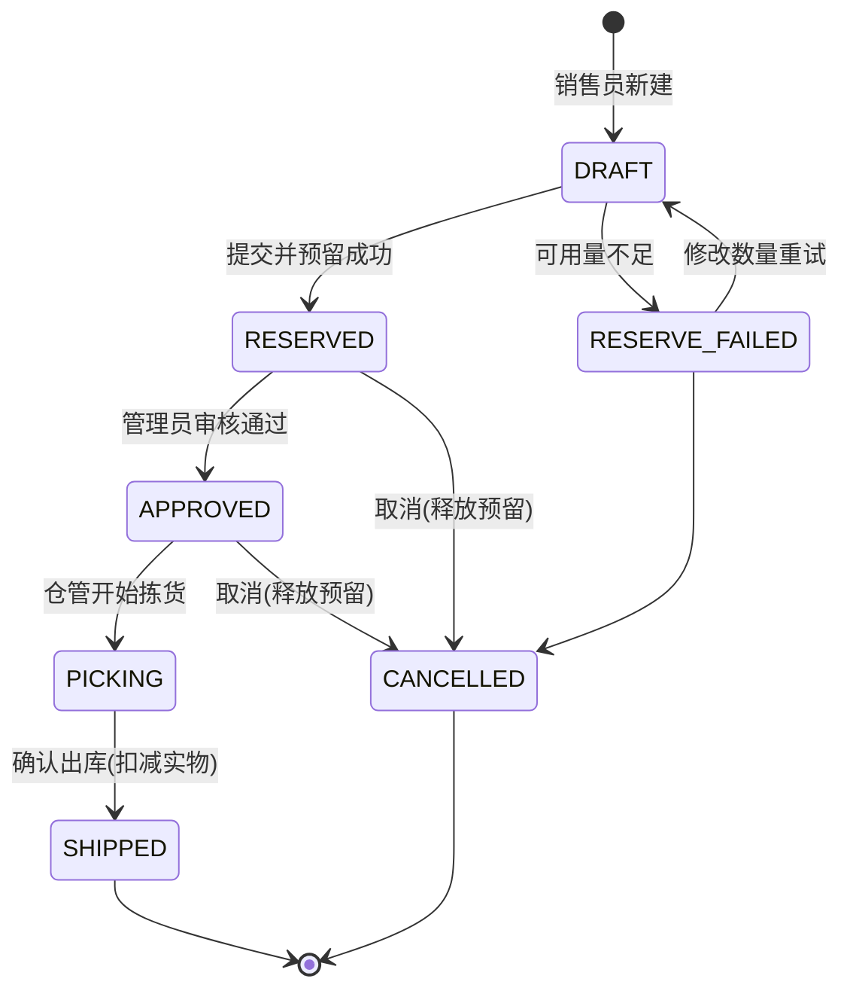
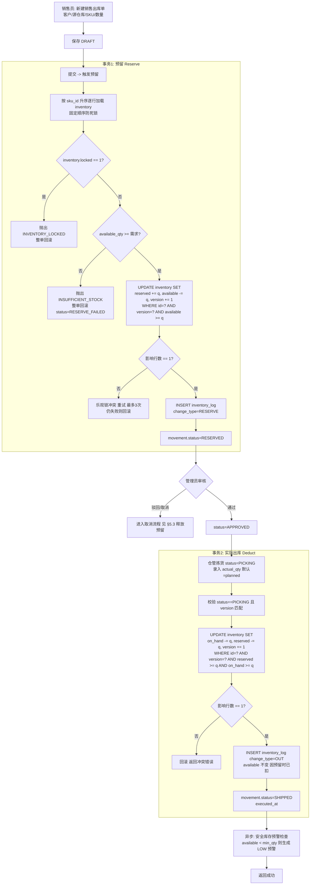
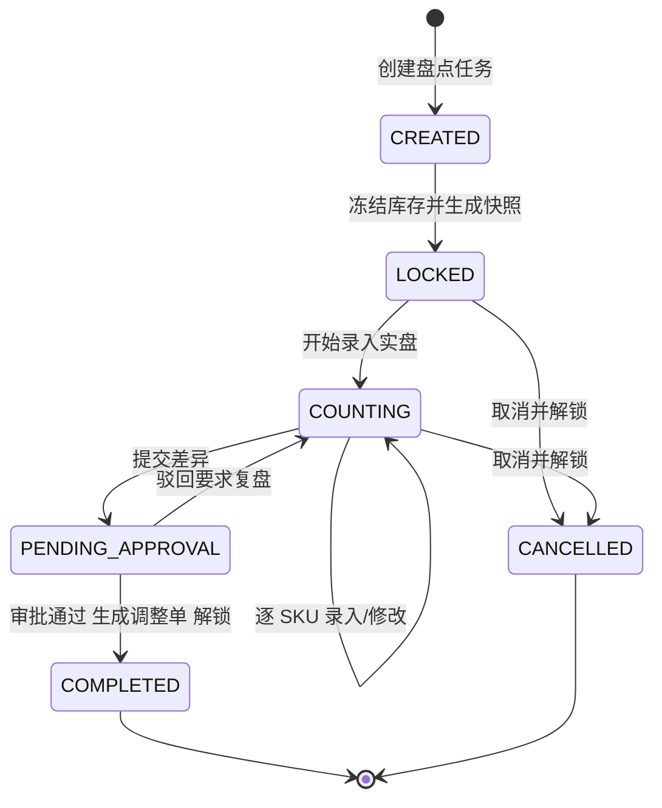
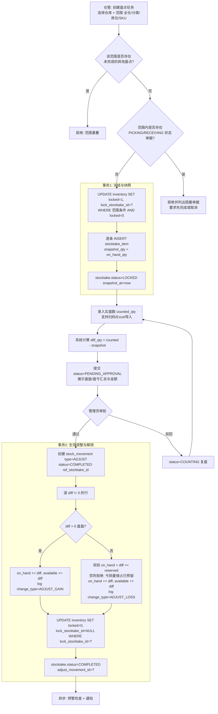
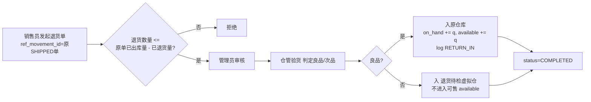

# 库存管理系统 (IMS) 需求规格说明书 (PRD)

| 项目 | 内容 |
|---|---|
| 文档版本 | v1.0 |
| 技术基线 | Spring Boot 三层架构 + Spring Data JPA + MySQL 8 (utf8mb4)；前端单文件 HTML + Vue 3 (CDN) + Element Plus (CDN)，位于 `src/main/resources/static/` |
| 统一响应 | `Result<T> { code, message, data }` |
| 适用范围 | 中小企业多仓库商品库存管理 |

---

## 1. 业务背景与设计目标

### 1.1 业务痛点
- 库存不准：账实不符，多人同时操作导致数量被覆盖，出现负库存或超卖。
- 无追溯：出入库仅记录结果，无法回答"某一时刻某 SKU 在某仓库为什么变成了这个数"。
- 多仓调拨混乱：调拨在途状态不明，调出方已扣、调入方未加，货物"消失"。

### 1.2 设计目标
| 目标 | 可量化验收标准 |
|---|---|
| 数据一致性 | 任意时刻 `available_qty >= 0`，`on_hand_qty = available_qty + reserved_qty`；并发压测下无超卖 |
| 完整审计 (Audit Trail) | 所有库存数量变动必须且仅能通过 `inventory_log` 记录，每条日志含变动前后值、单据来源、操作人、时间；日志只增不改不删 |
| 库存预警 | SKU 在任一仓库可用量低于安全库存时，1 分钟内产生预警记录并在首页展示 |
| 可追溯 | 任意库存变动可回溯到唯一单据号与明细行 |

### 1.3 关键设计原则
1. **单一变动入口**：库存主表只允许被 `InventoryService` 的原子方法修改（`increase / reserve / release / deduct / adjust`），Controller 与其他 Service 禁止直接写 `inventory` 表。
2. **单据驱动**：任何库存变化都必须挂靠一张已审核的单据（采购入库、销售出库、调拨、盘点、退货）。
3. **状态机约束**：单据状态只能沿预定义路径流转，非法跃迁一律拒绝。
4. **日志与库存同事务**：`inventory` 更新与 `inventory_log` 写入必须在同一个 `@Transactional` 中完成，任一失败整体回滚。

---

## 2. 角色与权限矩阵 (RBAC)

### 2.1 角色定义
| 角色 | 编码 | 描述 |
|---|---|---|
| 超级管理员 | `ROLE_ADMIN` | 系统级配置、用户与权限管理、所有业务的最终审批与强制操作 |
| 仓库管理员 | `ROLE_WAREHOUSE` | 负责所辖仓库的实物操作：验货入库、拣货出库、盘点、调拨执行 |
| 采购/销售人员 | `ROLE_BIZ` | 发起采购单与销售单，维护供应商/客户，查看库存但不能改动实物 |

### 2.2 权限矩阵
> ✅ 允许 ｜ 🔒 仅限所辖仓库 ｜ 👁 只读 ｜ ❌ 禁止

| 功能域 | 功能点 | 超级管理员 | 仓库管理员 | 采购/销售人员 |
|---|---|---|---|---|
| 系统管理 | 用户 / 角色 / 权限管理 | ✅ | ❌ | ❌ |
| 系统管理 | 仓库、库位新增/停用 | ✅ | 👁 | 👁 |
| 系统管理 | 审计日志查询 | ✅ | 🔒 | ❌ |
| 基础数据 | 商品 SKU 新增/编辑/停用 | ✅ | 👁 | ✅（新增/编辑，不可停用） |
| 基础数据 | 设置安全库存阈值 | ✅ | 🔒 | ❌ |
| 基础数据 | 供应商 / 客户维护 | ✅ | 👁 | ✅ |
| 采购入库 | 新建采购入库单 | ✅ | ❌ | ✅ |
| 采购入库 | 审核采购入库单 | ✅ | ❌ | ❌ |
| 采购入库 | 验货入库（确认实收） | ✅ | 🔒 | ❌ |
| 销售出库 | 新建销售出库单（触发预留） | ✅ | ❌ | ✅ |
| 销售出库 | 审核销售出库单 | ✅ | ❌ | ❌ |
| 销售出库 | 拣货 / 确认出库 | ✅ | 🔒 | ❌ |
| 销售出库 | 取消单据（释放预留） | ✅ | ❌ | ✅（仅自己创建且未出库） |
| 退货 | 销售退货入库 / 采购退货出库 | ✅ | 🔒（执行） | ✅（发起） |
| 调拨 | 新建 / 审核调拨单 | ✅ | 🔒（新建） | ❌ |
| 调拨 | 调出确认 / 调入确认 | ✅ | 🔒 | ❌ |
| 盘点 | 创建盘点任务（锁定库存） | ✅ | 🔒 | ❌ |
| 盘点 | 录入实盘数 | ✅ | 🔒 | ❌ |
| 盘点 | 审批盘盈盘亏并生效 | ✅ | ❌ | ❌ |
| 查询 | 库存实时查询 | ✅ | 🔒 | 👁 |
| 查询 | 库存变动日志 (Inventory Log) | ✅ | 🔒 | 👁（仅关联自己单据） |
| 预警 | 查看 / 处理低库存预警 | ✅ | 🔒 | 👁 |

### 2.3 权限实现要点
- 采用 `用户 (N) — (M) 角色 (N) — (M) 权限点` 模型，权限点编码形如 `purchase:approve`、`inventory:adjust`。
- 仓库管理员通过 `user_warehouse` 关联表限定数据范围，Service 层统一拦截 `warehouseId` 归属校验。
- **发起人与审核人分离**：同一用户不可审核自己创建的单据（超级管理员例外，但需写审计日志）。

---

## 3. 核心业务实体与数据关系 (Data Entities)

### 3.1 ER 总览



### 3.2 实体详细定义

#### 3.2.1 商品 SPU / SKU
`SPU (product)`：商品抽象概念（如"纯棉T恤"）。

| 字段 | 类型 | 说明 |
|---|---|---|
| id | BIGINT PK | |
| name | VARCHAR(100) | 商品名 |
| category_id | BIGINT FK | 分类 |
| brand | VARCHAR(50) | |
| unit | VARCHAR(10) | 基础计量单位（件/箱/kg） |
| status | TINYINT | 1 启用 / 0 停用 |
| created_at / updated_at | TIMESTAMP | |

`SKU (product_sku)`：可库存化的最小单元（如"纯棉T恤-红-XL"）。**库存、单据明细、日志全部挂 SKU，不挂 SPU。**

| 字段 | 类型 | 说明 |
|---|---|---|
| id | BIGINT PK | |
| spu_id | BIGINT FK → product | |
| sku_code | VARCHAR(50) UNIQUE | 业务编码，条码扫描主键 |
| barcode | VARCHAR(64) UNIQUE | 可选 |
| spec_json | JSON | 规格属性 `{"color":"红","size":"XL"}` |
| cost_price | DECIMAL(12,2) | 成本价 |
| sale_price | DECIMAL(12,2) | 售价 |
| default_safety_stock | INT | 全局默认安全库存（可被仓库级规则覆盖） |
| status | TINYINT | |
| version | INT | 乐观锁 |

关系：`SPU 1:N SKU`。

#### 3.2.2 仓库 / 库位
`warehouse`

| 字段 | 说明 |
|---|---|
| id, code(UNIQUE), name, address, manager_user_id, status | 常规 |
| type | 实体仓 / 虚拟仓（如"在途仓"、"退货待检仓"） |

`location`（库位，选配）

| 字段 | 说明 |
|---|---|
| id, warehouse_id FK, code(仓内唯一), zone, shelf, status | 如 `A-01-03` |

关系：`Warehouse 1:N Location`。

#### 3.2.3 供应商 / 客户
`supplier` / `customer` 结构相同：`id, code(UNIQUE), name, contact_person, phone, address, status, remark`。
关系：`Supplier 1:N StockMovement(type=PURCHASE_IN / PURCHASE_RETURN)`、`Customer 1:N StockMovement(type=SALE_OUT / SALE_RETURN)`。

#### 3.2.4 库存主表 `inventory`（核心）
唯一键：`(sku_id, warehouse_id, location_id)`，`location_id` 为空时取 0。

| 字段 | 类型 | 说明 |
|---|---|---|
| id | BIGINT PK | |
| sku_id | BIGINT FK | |
| warehouse_id | BIGINT FK | |
| location_id | BIGINT FK NULL | |
| on_hand_qty | INT NOT NULL DEFAULT 0 | 实物在库数 |
| reserved_qty | INT NOT NULL DEFAULT 0 | 已被销售单预留、尚未出库 |
| available_qty | INT NOT NULL DEFAULT 0 | 可售 = on_hand - reserved（冗余存储便于查询与 CHECK） |
| in_transit_qty | INT DEFAULT 0 | 调拨在途（仅目标仓库记录） |
| locked | TINYINT DEFAULT 0 | 盘点锁定标记 |
| lock_stocktake_id | BIGINT NULL | 锁定来源盘点单 |
| version | INT NOT NULL DEFAULT 0 | **乐观锁版本号** |
| updated_at | TIMESTAMP | |

数据库约束：
```sql
CONSTRAINT chk_inventory_nonneg CHECK (on_hand_qty >= 0 AND reserved_qty >= 0 AND available_qty >= 0),
CONSTRAINT chk_inventory_balance CHECK (available_qty = on_hand_qty - reserved_qty),
UNIQUE KEY uk_sku_wh_loc (sku_id, warehouse_id, location_id)
```

关系：`SKU 1:N Inventory`、`Warehouse 1:N Inventory`、`Inventory 1:N InventoryLog`。

#### 3.2.5 出入库单据 `stock_movement` + 明细 `stock_movement_item`
所有单据统一一张主表，以 `type` 区分，便于统一审核、统一日志、统一查询。

`stock_movement`

| 字段 | 类型 | 说明 |
|---|---|---|
| id | BIGINT PK | |
| movement_no | VARCHAR(32) UNIQUE | 单号，规则 `{类型前缀}{yyyyMMdd}{6位序列}`，如 `PI20260910000012` |
| type | ENUM | `PURCHASE_IN` 采购入库 / `SALE_OUT` 销售出库 / `SALE_RETURN` 销售退货入库 / `PURCHASE_RETURN` 采购退货出库 / `TRANSFER` 调拨 / `ADJUST` 盘点调整 / `OTHER_IN` / `OTHER_OUT` |
| status | ENUM | 见 §4 各状态机 |
| warehouse_id | BIGINT FK | 源仓库（入库为目标仓库） |
| to_warehouse_id | BIGINT FK NULL | 调拨目标仓库 |
| partner_type / partner_id | ENUM + BIGINT | SUPPLIER / CUSTOMER |
| ref_movement_id | BIGINT NULL | 退货单关联原单 |
| ref_stocktake_id | BIGINT NULL | ADJUST 类型关联盘点单 |
| total_qty / total_amount | INT / DECIMAL | 汇总 |
| creator_id, approver_id, executor_id | BIGINT | 发起 / 审核 / 执行人 |
| approved_at, executed_at, cancelled_at | TIMESTAMP | |
| cancel_reason, remark | VARCHAR | |
| version | INT | 乐观锁，防止重复审核/重复执行 |

`stock_movement_item`

| 字段 | 说明 |
|---|---|
| id, movement_id FK, sku_id FK, location_id NULL | |
| planned_qty | 计划数量（下单数） |
| actual_qty | 实际数量（验货实收 / 实际发出），执行前为 NULL |
| unit_price, amount | 单价、金额 |
| batch_no, expire_date | 批次（可选扩展） |
| remark | |

关系：`StockMovement 1:N StockMovementItem`、`StockMovementItem 1:N InventoryLog`。

#### 3.2.6 变动明细日志 `inventory_log`（Audit Trail，只增表）

| 字段 | 类型 | 说明 |
|---|---|---|
| id | BIGINT PK | |
| inventory_id | BIGINT FK | |
| sku_id, warehouse_id, location_id | BIGINT | 冗余，便于查询无需 JOIN |
| change_type | ENUM | `IN` 入库 / `OUT` 出库 / `RESERVE` 预留 / `RELEASE` 释放预留 / `TRANSFER_OUT` / `TRANSFER_IN` / `ADJUST_GAIN` 盘盈 / `ADJUST_LOSS` 盘亏 / `RETURN_IN` / `RETURN_OUT` |
| on_hand_before / on_hand_after | INT | |
| reserved_before / reserved_after | INT | |
| available_before / available_after | INT | |
| delta_qty | INT | 有符号变动量 |
| movement_id, movement_item_id | BIGINT | 来源单据及明细行 |
| stocktake_id | BIGINT NULL | 盘点来源 |
| operator_id | BIGINT | |
| operated_at | TIMESTAMP(3) | 毫秒精度 |
| trace_id | VARCHAR(64) | 同一事务内多条日志共享，用于整单回溯 |
| remark | VARCHAR(255) | |

约束：应用层禁止提供 UPDATE/DELETE 接口；数据库用户对该表仅授予 `INSERT, SELECT`。

#### 3.2.7 盘点 `stocktake` + `stocktake_item`
`stocktake`：`id, stocktake_no, warehouse_id, scope(ALL / BY_CATEGORY / BY_LOCATION / BY_SKU), status, snapshot_at, creator_id, approver_id, adjust_movement_id, remark`。
`stocktake_item`：`id, stocktake_id, sku_id, location_id, snapshot_qty(系统冻结数), counted_qty(实盘数), diff_qty, diff_reason`。

#### 3.2.8 安全库存与预警
`safety_stock_rule`：`id, sku_id, warehouse_id(NULL 表示全局), min_qty, max_qty, enabled`。
`stock_alert`：`id, sku_id, warehouse_id, alert_type(LOW / OVER / ZERO), current_qty, threshold, status(OPEN / ACKED / CLOSED), created_at, handled_by, handled_at`。

### 3.3 关系汇总

| 关系 | 类型 |
|---|---|
| SPU → SKU | 1:N |
| Warehouse → Location | 1:N |
| SKU ↔ Warehouse（经 Inventory） | N:M |
| Inventory → InventoryLog | 1:N |
| StockMovement → StockMovementItem | 1:N |
| StockMovementItem → InventoryLog | 1:N（一行销售明细产生 RESERVE + OUT 两条） |
| Supplier / Customer → StockMovement | 1:N |
| StockMovement(退货) → StockMovement(原单) | N:1（一张原单可多次退货） |
| Stocktake → StocktakeItem | 1:N |
| Stocktake → StockMovement(ADJUST) | 1:0..1 |
| SKU → SafetyStockRule | 1:N |
| User ↔ Role ↔ Permission | N:M, N:M |
| User ↔ Warehouse | N:M |

---

## 4. 核心业务流程与状态机

### 4.1 采购入库流程

#### 4.1.1 状态机


#### 4.1.2 业务流程


关键规则：
- 库存增加只发生在 `RECEIVING → COMPLETED` 这一步，审核不改库存。
- 实收 < 计划允许（记录差异），实收 > 计划默认拒绝。
- 同一单据不可重复执行：执行前检查 `status == APPROVED/RECEIVING` 且 `version` 匹配。

### 4.2 销售出库与预留（Reserve）流程

#### 4.2.1 状态机


#### 4.2.2 业务流程


关键规则：
- **两阶段扣减**：预留阶段扣 `available`，出库阶段扣 `on_hand` 与 `reserved`；`available` 在出库阶段不再变化，杜绝重复扣减。
- 超卖的唯一判定点是预留阶段的 `available_qty >= q`，且由数据库 `WHERE available >= q` 二次兜底。
- 预留有过期机制：`RESERVED` 状态超过 N 小时（可配置，默认 48h）未审核，定时任务自动取消并释放。

### 4.3 盘点与盘盈盘亏处理流程

#### 4.3.1 状态机


#### 4.3.2 业务流程


关键规则：
- 快照基于 `on_hand_qty`（实物数），实盘数与实物数比对，`reserved_qty` 不参与盘点差异计算。
- 盘亏后若 `on_hand < reserved`，说明已预留的货实际不存在，系统拒绝自动生效，需人工先处理相关销售单。

---

## 5. 异常与边缘场景处理

### 5.1 高并发下防超卖与并发冲突

#### 5.1.1 策略选择
| 方案 | 适用 | 本系统采用 |
|---|---|---|
| 乐观锁（`version` 字段 + 条件 UPDATE） | 读多写少、冲突概率中低、中小企业量级 | **主策略** |
| 悲观锁（`SELECT ... FOR UPDATE`） | 批量单据、多行原子操作、需严格串行化 | **辅助**：入库/调拨/盘点生效等批量写场景 |
| 数据库 CHECK 约束 | 最后一道防线 | **必须** |
| 分布式锁（Redis） | 多实例部署 + 热点 SKU | 预留扩展点，v1 不引入 |

#### 5.1.2 乐观锁落地（JPA）
```java
@Entity
public class Inventory {
    @Version
    private Integer version;
    // ...
}

// 条件更新，业务约束下推到 SQL，避免 "读-改-写" 竞态
@Modifying
@Query("""
    UPDATE Inventory i
       SET i.reservedQty = i.reservedQty + :q,
           i.availableQty = i.availableQty - :q,
           i.version = i.version + 1
     WHERE i.id = :id
       AND i.version = :version
       AND i.availableQty >= :q
       AND i.locked = 0
""")
int reserve(@Param("id") Long id, @Param("version") Integer version, @Param("q") int q);
```
- 返回值 `0` 表示：版本冲突 **或** 库存不足 **或** 被锁定。Service 重新读取判断具体原因：不足/锁定直接失败；版本冲突则重试（最多 3 次，指数退避 20/40/80 ms），超过后抛 `CONCURRENT_CONFLICT` 提示用户重试。
- 多行单据按 `sku_id` 升序处理，避免两单交叉更新导致死锁。
- 所有异常均触发 `@Transactional(rollbackFor = Exception.class)` 整体回滚，不允许部分行成功。

#### 5.1.3 幂等控制
- 单据执行接口（审核、入库确认、出库确认、盘点生效）要求携带 `version`，服务端 `WHERE id=? AND status=? AND version=?` 更新状态，影响行数为 0 则返回 `409 STATE_CONFLICT`。
- 前端提交按钮点击后禁用，直至响应返回。
- 创建类接口支持可选 `Idempotency-Key` 请求头，服务端按 key 去重 24h。

#### 5.1.4 数据库兜底
```sql
CHECK (on_hand_qty >= 0 AND reserved_qty >= 0 AND available_qty >= 0)
CHECK (available_qty = on_hand_qty - reserved_qty)
```
任何绕过应用逻辑的写入（如手工 SQL）触发约束失败，MySQL 8.0.16+ 生效。

#### 5.1.5 验收方式
- 并发测试：100 线程对同一 SKU（`available=50`）各预留 1 件，最终成功 50、失败 50、`available=0`、日志恰 50 条。

### 5.2 盘点期间出入库隔离与锁定

| 层面 | 措施 |
|---|---|
| 前置检查 | 创建盘点时，范围内若存在 `RECEIVING`/`PICKING` 中的单据，拒绝创建并列出阻塞单号 |
| 行级锁标 | `inventory.locked=1` + `lock_stocktake_id`；所有变动 SQL 的 `WHERE` 追加 `locked = 0`，影响行数为 0 时抛 `INVENTORY_LOCKED` |
| 允许的操作 | 新建/审核单据（不触库存）仍允许；**预留**、**出库确认**、**入库确认**、**调拨确认**均被拒绝并提示"该 SKU 正在盘点（盘点单 XXX），预计解锁时间" |
| 紧急放行 | 超级管理员可对单个 SKU "临时解锁"，系统自动将该 SKU 从本次盘点范围移除（`stocktake_item` 标记 `excluded=1`），并写审计日志 |
| 超时保护 | 盘点 `LOCKED/COUNTING` 超过 72h 未完成，定时任务发通知给管理员；超过 7 天自动取消并解锁 |
| 快照一致性 | 快照与加锁在同一事务内，先 `UPDATE ... locked=1` 再读取 `on_hand_qty`，确保快照值是锁定后的值 |
| 分范围盘点 | 支持按库位/分类分批盘点，缩小锁定面，减少对日常业务影响 |

### 5.3 订单取消与退货的库存回滚

#### 5.3.1 销售出库单取消（按状态分支）
| 取消时状态 | 库存动作 | 日志 |
|---|---|---|
| `DRAFT` / `RESERVE_FAILED` | 无 | 无 |
| `RESERVED` / `APPROVED` / `PICKING` | **释放预留**：`reserved -= q, available += q`（`WHERE reserved >= q`） | `RELEASE` |
| `SHIPPED` | 不允许取消，必须走 **销售退货** 单 | — |

释放预留同样使用乐观锁条件更新，与预留操作成对出现，`trace_id` 关联原预留日志。

#### 5.3.2 销售退货入库 `SALE_RETURN`

- 原单维护 `returned_qty` 累计值，防止重复退货超出原量。
- 次品入虚拟仓后可通过 `OTHER_OUT`（报废）或 `TRANSFER`（返修后回良品仓）处理。

#### 5.3.3 采购入库单取消与采购退货
| 场景 | 处理 |
|---|---|
| `APPROVED` 未验货取消 | 仅改状态，无库存动作 |
| `COMPLETED` 后发现问题 | 走 **采购退货出库** `PURCHASE_RETURN`：需 `available >= q`，执行 `on_hand -= q, available -= q`，日志 `RETURN_OUT`，若可用量不足（已被预留）则拒绝 |

#### 5.3.4 调拨单回滚
- 调拨采用"调出确认 / 调入确认"两步：调出时 `源仓 on_hand -= q, available -= q`，目标仓 `in_transit += q`；调入时目标仓 `in_transit -= q, on_hand += q, available += q`。
- 在途中取消：反向执行调出（源仓加回、目标仓在途减去），日志 `TRANSFER_IN` 反向记录，`remark = 调拨取消回滚`。
- 调入已确认后不可取消，需新建反向调拨单。

#### 5.3.5 回滚通用原则
1. 回滚永远是**新增一条反向日志**，绝不删除或修改原日志。
2. 回滚数量不得超过原操作数量（累计校验）。
3. 回滚操作同样受盘点锁定约束。

### 5.4 其他边缘场景
| 场景 | 处理 |
|---|---|
| SKU 停用时仍有库存 | 允许停用但禁止新建入库；已有库存可出库/调拨/盘点直至清零 |
| 仓库停用 | 需库存全部为 0 且无未完成单据 |
| 删除单据 | 只允许 `DRAFT` 状态物理删除；其余状态只能 `CANCELLED` |
| 库存数据修复 | 禁止直接改表；提供"库存调整单"`ADJUST`，须超级管理员审批并填写原因 |
| 时区 | 数据库统一 UTC，前端按浏览器时区展示 |
| 事务边界 | Service 方法级 `@Transactional`；Controller 不开事务；异步预警检查在事务提交后通过 `TransactionSynchronization.afterCommit` 触发 |

---

## 6. 功能模块清单 (Feature List)

> API 前缀统一 `/api/v1`，鉴权 `Authorization: Bearer <JWT>`，响应体 `Result<T>`。列表接口统一支持 `page, size, sort` 及业务过滤参数，返回 `Result<PageResult<T>>`。

### 6.1 认证与权限 (auth)
| 功能点 | 前端页面描述 | 后端 API |
|---|---|---|
| 登录 / 登出 | 登录页：用户名 + 密码，记住我 | `POST /auth/login` → `{token, user, permissions[]}`；`POST /auth/logout` |
| 当前用户信息 | 顶栏头像下拉，显示角色与所辖仓库 | `GET /auth/me` |
| 用户管理 | 表格 + 弹窗表单，可分配角色与仓库范围 | `GET/POST /users`，`PUT /users/{id}`，`PUT /users/{id}/roles`，`PUT /users/{id}/warehouses`，`PUT /users/{id}/status` |
| 角色权限管理 | 角色列表 + 权限树勾选 | `GET/POST /roles`，`PUT /roles/{id}/permissions`，`GET /permissions` |

### 6.2 基础数据 (master-data)
| 功能点 | 前端页面描述 | 后端 API |
|---|---|---|
| 商品 SPU 管理 | 表格（名称/分类/品牌/状态）+ 新增编辑弹窗 | `GET/POST /products`，`GET/PUT /products/{id}`，`PUT /products/{id}/status` |
| SKU 管理（多规格） | SPU 详情内 Tab，动态规格属性表单，生成 SKU 编码/条码 | `GET /products/{id}/skus`，`POST /products/{id}/skus`，`PUT /skus/{id}`，`PUT /skus/{id}/status`，`GET /skus?keyword=`（扫码/搜索通用） |
| 商品分类 | 树形控件 | `GET/POST /categories`，`PUT/DELETE /categories/{id}` |
| 仓库管理 | 表格 + 表单，含类型（实体/虚拟） | `GET/POST /warehouses`，`PUT /warehouses/{id}`，`PUT /warehouses/{id}/status` |
| 库位管理 | 仓库详情内表格，支持批量生成 `区-排-层` | `GET /warehouses/{id}/locations`，`POST /warehouses/{id}/locations/batch`，`PUT /locations/{id}` |
| 供应商管理 | 表格 + 表单 | `GET/POST /suppliers`，`PUT /suppliers/{id}`，`PUT /suppliers/{id}/status` |
| 客户管理 | 表格 + 表单 | `GET/POST /customers`，`PUT /customers/{id}`，`PUT /customers/{id}/status` |
| 安全库存规则 | 表格，按 SKU+仓库设置上下限，支持 Excel 批量导入 | `GET/POST /safety-stock-rules`，`PUT /safety-stock-rules/{id}`，`POST /safety-stock-rules/import` |

### 6.3 库存查询 (inventory)
| 功能点 | 前端页面描述 | 后端 API |
|---|---|---|
| 实时库存查询 | 表格：SKU/仓库/库位/在库/预留/可用/在途/锁定标记；筛选仓库、分类、关键字、仅低库存 | `GET /inventory?warehouseId&skuId&categoryId&keyword&lowStockOnly` |
| SKU 库存分布 | SKU 详情抽屉，按仓库展示柱状/表格 | `GET /inventory/sku/{skuId}` |
| 库存变动日志 | 表格：时间/SKU/仓库/类型/变动量/前后值/单据号/操作人；点击单据号跳转 | `GET /inventory/logs?skuId&warehouseId&changeType&movementNo&from&to` |
| 库存流水导出 | 按当前筛选条件导出 Excel | `GET /inventory/logs/export` |
| 临时解锁（盘点期） | 管理员在库存行操作列 | `POST /inventory/{id}/unlock`（需 `inventory:unlock`） |

### 6.4 采购入库 (purchase-in)
| 功能点 | 前端页面描述 | 后端 API |
|---|---|---|
| 单据列表 | 表格 + 状态 Tag 筛选，操作列按状态动态显示 | `GET /movements?type=PURCHASE_IN&status&warehouseId&supplierId&from&to` |
| 新建 / 编辑 | 表单：供应商、目标仓库、明细表（SKU 搜索、计划数、单价） | `POST /movements/purchase-in`，`PUT /movements/{id}`（仅 DRAFT/REJECTED） |
| 提交审核 | 按钮，二次确认 | `POST /movements/{id}/submit` `{version}` |
| 审核 / 驳回 | 详情页审核区，驳回需填原因 | `POST /movements/{id}/approve` `{version}`，`POST /movements/{id}/reject` `{version, reason}` |
| 验货入库 | 详情页明细表可编辑 `actual_qty`，支持扫码累加，可选库位 | `POST /movements/{id}/receive` `{version, items:[{itemId, actualQty, locationId}]}` |
| 取消 | 按钮 | `POST /movements/{id}/cancel` `{version, reason}` |
| 详情 | 单据信息 + 明细 + 关联日志 + 操作时间线 | `GET /movements/{id}`，`GET /movements/{id}/logs` |

### 6.5 销售出库 (sale-out)
| 功能点 | 前端页面描述 | 后端 API |
|---|---|---|
| 单据列表 | 同上，突出 `RESERVED` 与 `RESERVE_FAILED` | `GET /movements?type=SALE_OUT&...` |
| 新建 | 表单：客户、源仓库、明细（实时显示该仓可用量，超量红色提示） | `POST /movements/sale-out`，`GET /inventory/available?warehouseId&skuIds=` |
| 提交（预留） | 按钮；失败时弹窗列出不足 SKU 与当前可用量 | `POST /movements/{id}/submit` `{version}` → 成功 `RESERVED`，失败返回 `code=INSUFFICIENT_STOCK, data=[{skuId, need, available}]` |
| 审核 / 驳回 | 同采购 | `POST /movements/{id}/approve`，`/reject` |
| 拣货 | 按钮进入 `PICKING`，打印拣货单 | `POST /movements/{id}/pick` `{version}`，`GET /movements/{id}/print` |
| 确认出库 | 明细确认 `actual_qty`（默认=计划，不可超） | `POST /movements/{id}/ship` `{version, items:[...]}` |
| 取消（释放预留） | 按钮，SHIPPED 后隐藏 | `POST /movements/{id}/cancel` `{version, reason}` |

### 6.6 退货 (returns)
| 功能点 | 前端页面描述 | 后端 API |
|---|---|---|
| 销售退货 | 从原出库单详情"发起退货"，明细默认可退量=已出-已退 | `POST /movements/sale-return` `{refMovementId, items}`，审核/执行复用通用接口，执行 `POST /movements/{id}/receive` 含 `condition: GOOD/DEFECTIVE` |
| 采购退货 | 从原入库单详情发起 | `POST /movements/purchase-return`，执行 `POST /movements/{id}/ship` |

### 6.7 调拨 (transfer)
| 功能点 | 前端页面描述 | 后端 API |
|---|---|---|
| 调拨单列表 | 表格：源仓/目标仓/状态（在途高亮） | `GET /movements?type=TRANSFER&...` |
| 新建调拨 | 表单：源仓、目标仓（不可相同）、明细 | `POST /movements/transfer` |
| 审核 | 同上 | `POST /movements/{id}/approve` |
| 调出确认 | 源仓仓管操作 | `POST /movements/{id}/transfer-out` `{version, items}` |
| 调入确认 | 目标仓仓管操作，可指定库位 | `POST /movements/{id}/transfer-in` `{version, items}` |
| 在途取消 | 管理员操作 | `POST /movements/{id}/cancel` |

### 6.8 盘点 (stocktake)
| 功能点 | 前端页面描述 | 后端 API |
|---|---|---|
| 盘点任务列表 | 表格：仓库/范围/状态/差异汇总 | `GET /stocktakes?warehouseId&status` |
| 创建盘点 | 表单：仓库、范围类型（全仓/分类/库位/SKU）、范围值；预检结果展示阻塞单据 | `POST /stocktakes/precheck`，`POST /stocktakes` |
| 冻结并快照 | 按钮，确认后锁定 | `POST /stocktakes/{id}/lock` |
| 录入实盘 | 表格可编辑 `counted_qty`，扫码累加，Excel 导入，差异列自动着色 | `GET /stocktakes/{id}/items`，`PUT /stocktakes/{id}/items/{itemId}` `{countedQty, reason}`，`POST /stocktakes/{id}/items/import` |
| 提交差异 | 汇总弹窗：盘盈 N 项/金额、盘亏 N 项/金额 | `POST /stocktakes/{id}/submit` |
| 审批生效 / 驳回复盘 | 管理员详情页 | `POST /stocktakes/{id}/approve`，`POST /stocktakes/{id}/reject` |
| 取消并解锁 | 按钮 | `POST /stocktakes/{id}/cancel` |
| 盘点报告 | 导出 Excel/PDF | `GET /stocktakes/{id}/report` |

### 6.9 库存预警 (alerts)
| 功能点 | 前端页面描述 | 后端 API |
|---|---|---|
| 预警列表 | 首页卡片 + 独立页面表格：类型（低库存/零库存/超储）、SKU、仓库、当前量、阈值、状态 | `GET /alerts?status&warehouseId&type` |
| 确认 / 关闭 | 操作列 | `POST /alerts/{id}/ack`，`POST /alerts/{id}/close` |
| 一键生成采购单 | 从低库存预警批量选中 → 预填采购入库单 | `POST /alerts/generate-purchase` `{alertIds, supplierId}` |
| 手动触发检查 | 管理员按钮 | `POST /alerts/scan`（同时由定时任务每 5 分钟执行 + 出库后事务提交后即时触发） |

### 6.10 仪表盘与报表 (dashboard)
| 功能点 | 前端页面描述 | 后端 API |
|---|---|---|
| 首页概览 | 卡片：SKU 总数/总库存金额/待审核单据数/预警数；近 30 天出入库趋势折线图；库存 Top10 | `GET /dashboard/summary`，`GET /dashboard/trend?days=30`，`GET /dashboard/top-skus` |
| 出入库汇总报表 | 按仓库/分类/时间段统计，导出 | `GET /reports/movement-summary?from&to&warehouseId&groupBy` |
| 库龄分析（扩展） | 表格 | `GET /reports/stock-age` |

### 6.11 系统与审计 (system)
| 功能点 | 前端页面描述 | 后端 API |
|---|---|---|
| 操作审计日志 | 表格：谁、何时、对哪个资源做了什么（登录/审核/解锁/权限变更） | `GET /audit-logs?userId&action&from&to` |
| 系统参数 | 预留超时小时数、盘点超时天数、单号规则 | `GET/PUT /settings` |

---

## 7. 非功能性需求

| 类别 | 要求 |
|---|---|
| 性能 | 库存查询接口 P95 < 300ms（10 万 SKU × 10 仓）；单据执行 P95 < 500ms |
| 并发 | 单 SKU 100 并发预留无超卖；整体 200 TPS |
| 可用性 | 单实例部署下依赖 MySQL 事务保证一致性；预留 Redis 分布式锁扩展点以支持多实例 |
| 安全 | JWT 鉴权 + 方法级 `@PreAuthorize`；密码 BCrypt；SQL 全部参数化；敏感操作审计 |
| 审计不可篡改 | `inventory_log`、`audit_log` 数据库账号仅 `INSERT/SELECT` |
| 数据库 | MySQL 8.0.16+（CHECK 约束生效）、utf8mb4、InnoDB、`READ COMMITTED` 隔离级别 |
| 可观测 | 每笔库存事务输出 `trace_id`；慢 SQL 日志；预警任务执行日志 |
| 备份 | 每日全量 + binlog 增量，保留 30 天 |

---

## 8. 统一响应与错误码

```json
{ "code": 0, "message": "success", "data": { } }
```

| code | 常量 | 含义 | HTTP |
|---|---|---|---|
| 0 | `OK` | 成功 | 200 |
| 40000 | `VALIDATION_ERROR` | 参数校验失败 | 400 |
| 40100 | `UNAUTHORIZED` | 未登录/Token 失效 | 401 |
| 40300 | `FORBIDDEN` | 无权限或仓库范围越权 | 403 |
| 40400 | `NOT_FOUND` | 资源不存在 | 404 |
| 40900 | `STATE_CONFLICT` | 单据状态或 version 不匹配（重复提交） | 409 |
| 40901 | `CONCURRENT_CONFLICT` | 乐观锁重试耗尽 | 409 |
| 42201 | `INSUFFICIENT_STOCK` | 可用库存不足，`data` 含明细 | 422 |
| 42202 | `INVENTORY_LOCKED` | 库存处于盘点锁定 | 422 |
| 42203 | `ILLEGAL_STATE_TRANSITION` | 非法状态流转 | 422 |
| 42204 | `RETURN_EXCEEDS_ORIGINAL` | 退货量超出原单 | 422 |
| 42205 | `STOCKTAKE_SCOPE_OVERLAP` | 盘点范围重叠 | 422 |
| 42206 | `STOCKTAKE_BLOCKED_BY_MOVEMENT` | 存在执行中单据阻塞盘点 | 422 |
| 42207 | `LOSS_EXCEEDS_RESERVED` | 盘亏后实物少于已预留 | 422 |
| 50000 | `INTERNAL_ERROR` | 未知错误 | 500 |

---

## 9. 与现有代码基线的差距说明

当前仓库 `inventory-system.sql` 中 `product.stock` 单字段、`stock_in` / `stock_out` 两张独立表的结构，与本 PRD 存在如下需要迁移的差异：

1. 库存从 `product.stock` 拆分到 `inventory (sku_id, warehouse_id, location_id)`，引入 `reserved_qty / available_qty / version / locked`。
2. `stock_in` / `stock_out` 合并为 `stock_movement + stock_movement_item`，以 `type` 与 `status` 驱动状态机。
3. 新增 `inventory_log` 作为唯一审计事实表，所有数量变化必须落日志。
4. `supplier` / `customer` 由字符串字段升级为独立实体表。
5. `application.yml` 中 `jpa.hibernate.ddl-auto: update` 仅限开发环境，生产必须改为 `validate` 并使用 Flyway/Liquibase 管理 DDL（CHECK 约束无法由 Hibernate 自动生成）。
